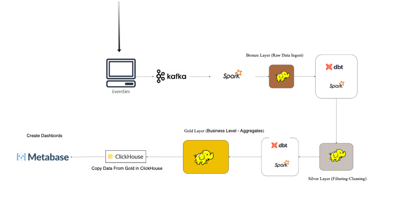

# Spotify Management
## Overview
In this project, we are going to focus on a data infrastructure for a company similar to Spotify that can process, store, and prepare reports on the massive data that is sent to us in real time.

## Phase 1
- In the first phase, we want to create a data lake. This data lake should be able to store data in a reliable way. We are also going to use the following architecture.

## Phase 2
- In this phase, we want to establish the connection between Spark, HDFS, ClickHouse and deepen the Data Modeling.
- We placed the data in HDFS in the Bronze layer in phase one. Now we are going to take the data from the Bronze layer and clean it in the Silver layer and remove the extra or corrupted fields and form the initial dimensions and simple facts tables. Spark is used to do this and a tool like dbt on Spark helps us to define the analytical models in a modular way and save them back to HDFS.
- We are also going to create a Gold layer where we can create attractive and effective reports and save them in HDFS and then take these reports to ClickHouse and visualize them with Metabase.
- Finally, we are going to have complete monitoring with Prometheus/Grafana. 🚀📊

## Directory Structure
    SpotifyManagement/
        ├── docs/
        ├── docker/
        │      └── docker-compose.yaml
        │      └── alertmanager.yml
        │      └── prometheus.yml
        │      └── telegram.tmpl
        ├── eventsim/
        ├── hadoop/
        ├── spark/
        ├── schema-registery/ 
        ├── requirements.txt
        └── README.md

## Tools and Technologies 🛠
- **Databases**: HDFS, ClickHouse
- **Workflow Management**: Apache Kafka, Apache Spark
- **Data Visualization**: Metabase
- **Programming Languages**: Python, DBT
- **Monitoring**: Grafana & Prometheus
- **Other Tools**: Docker

A general and comprehensive guide in this [README](guide.md)
