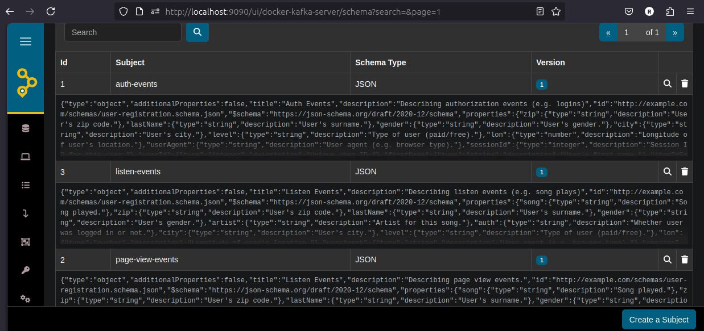

# Schema Registry Setup and Usage Guide

## Introduction

This document provides a detailed guide on setting up and using the Schema Registry with Kafka. The Schema Registry allows the central management of schemas and provides compatibility checks, making it an essential component for managing data formats in a Kafka-based ecosystem.

## Step-by-Step Guide

### Access the Kafka Broker Container

To open a bash session in the Kafka broker container, use the following command:

```sh
docker exec -it broker /bin/bash


Here is a detailed `README.md` file for your schema registry setup and usage guide in a technical writing style:

```markdown


### Navigate to Kafka Binaries Directory

Change the directory to the Kafka installation's bin folder where the Kafka scripts are located:

```sh
cd /opt/kafka/bin
```

### List All Kafka Topics

List all the topics available in the Kafka cluster:

```sh
./kafka-topics.sh --bootstrap-server localhost:9092 --list
```

### Produce a Valid JSON Message

Start the Kafka console producer to send messages to the `auth_events` topic:

```sh
./kafka-console-producer.sh --broker-list localhost:9092 --topic auth_events
```

### Send a Valid JSON Message

Type and send a valid JSON message to the `auth_events` topic:

```json
{"city":"Tokyo","firstName":"John","gender":"male","itemInSession":1,"lastName":"Doe","lat":35.6895,"level":"free","lon":139.6917,"registration":1582605074,"sessionId":123,"state":"Tokyo","success":true,"ts":1582605074,"userAgent":"Mozilla/5.0","userId":1,"zip":"100-0001"}
```

### Send an Invalid JSON Message

Type and send an invalid JSON message to simulate a schema validation failure:

```json
{"city":"Decatur","firstName":"Ryan"}
```

### Exit the Producer Console

Press `Ctrl+D` to exit the Kafka console producer.

### Consume Messages from the Topic

Start the Kafka console consumer to read messages from the `auth_events` topic. It will fetch one message from the beginning of the topic:

```sh
./kafka-console-consumer.sh --bootstrap-server localhost:9092 --topic auth_events --from-beginning --max-messages 1
```

### Ping the Schema Registry

Check if the Schema Registry is reachable from the broker container:

```sh
ping schema-registry
```

### List All Registered Subjects

Use `wget` to list all subjects (schemas) registered in the Schema Registry:

```sh
wget -qO- http://schema-registry:8085/subjects
```

### List Schema Versions for a Specific Subject

Use `wget` to list all versions of the `auth-events` schema:

```sh
wget -qO- http://schema-registry:8085/subjects/auth-events/versions
```

### Get Schema Details for a Specific Version

Use `wget` to get the details of version 1 of the `auth-events` schema:

```sh
wget -qO- http://schema-registry:8085/subjects/auth-events/versions/1
```

## Docker Compose Services

The following Docker Compose configuration is used to set up the Schema Registry:

```yaml
schema-registry:
  image: confluentinc/cp-schema-registry:latest
  restart: unless-stopped
  depends_on:
    - broker
  environment:
    SCHEMA_REGISTRY_KAFKASTORE_BOOTSTRAP_SERVERS: 'PLAINTEXT://broker:29092'
    SCHEMA_REGISTRY_LISTENERS: 'http://0.0.0.0:8085'
    SCHEMA_REGISTRY_HOST_NAME: 'schema-registry'
  networks:
    - data-highway
  healthcheck:
    test: ["CMD-SHELL", "curl -f http://schema-registry:8085/ || exit 1"]
    interval: 30s
    timeout: 10s
    retries: 5

schema-registry-init:
  image: confluentinc/cp-schema-registry:latest
  volumes:
    - ../schema-registry/entrypoint.sh:/scripts/entrypoint.sh
    - ../schema-registry/json:/schemas/json
  depends_on:
    schema-registry:
      condition: service_healthy
  entrypoint: ["/scripts/entrypoint.sh"]
  networks:
    - data-highway
```



This guide should assist in setting up and using the Schema Registry in a Kafka-based environment. 
For further assistance or additional configurations, refer to the official documentation or seek support from the community.
